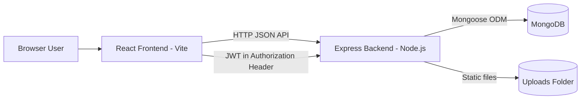
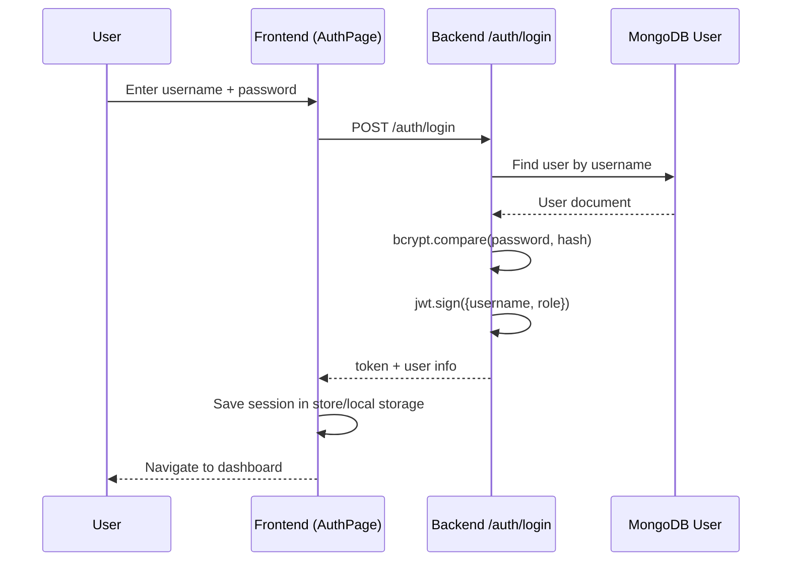
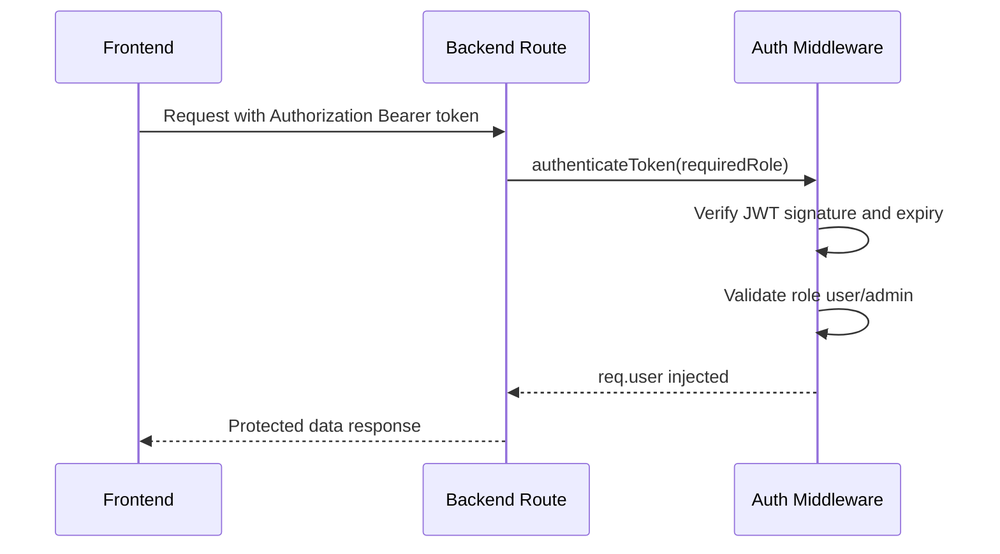
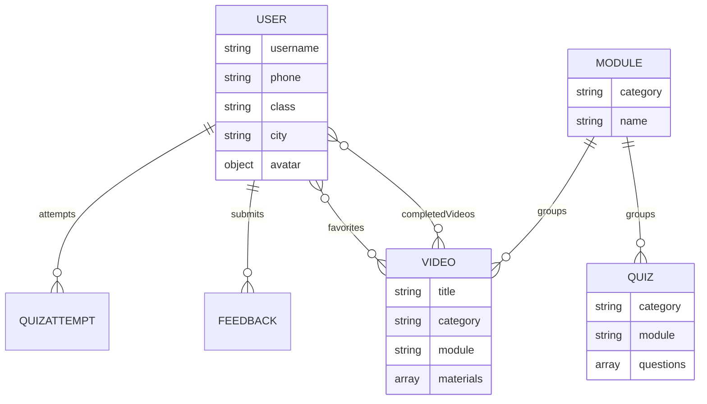
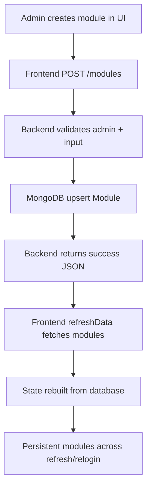

# MERN Web App Advanced Learning Module (Part 2)

This is Part 2 for your Biomics Hub project.

Goal of this module:
- Understand request flow deeply
- Understand JWT lifecycle end-to-end
- Understand database model relationships
- Understand animation and responsive strategy at architecture level
- Learn production-ready thinking (performance, scaling, security)

---

## 1. System Architecture Deep Dive

Biomics Hub is a role-based learning platform with two major actors:
- Student
- Admin

High-level architecture:

How to read this:
1. UI actions start in React components.
2. React calls backend routes through the API helper.
3. Backend verifies auth and role.
4. Backend talks to MongoDB models.
5. Backend sends JSON response.
6. React updates UI state and re-renders.

---

## 2. Login and JWT Lifecycle

### 2.1 Student login flow

### 2.2 Protected route flow

JWT best practices used in your app:
- Backend signs token using JWT_SECRET
- Frontend sends token in Authorization header
- Role checks enforce admin-only APIs
- Token refreshed on profile update if username changes

---

## 3. Data Model Relationships

Your important collections are:
- User
- Video
- Module
- Quiz
- QuizAttempt
- Feedback
- LiveClass

Important design pattern from your code:
- Module has a unique composite key: category + name
- This prevents duplicate module entries in same course category

---

## 4. Module Persistence Strategy (Case Study)

Problem you solved:
- Module list disappeared after refresh

Root cause:
- Module list existed only in frontend memory

Final architecture:

Also enforced in upload route:
- When admin uploads video with module name, backend also upserts that module.
- This keeps module data consistent with lecture data.

---

## 5. Frontend State and Rendering Logic

State layers in your app:
1. Global session store
- token
- role
- username
- login/logout methods

2. Theme store
- current theme
- toggle function

3. Page-level local state
- forms
- lists
- loading indicators
- banners
- modal open/close flags

Rendering rule:
- state change triggers React re-render
- UI updates are declarative, not manual DOM manipulation

---

## 6. API Helper Pattern (Why it matters)

Your api helper centralizes network behavior:
- base URL resolution for local and production
- auth header injection
- form-data handling
- error normalization

Benefits:
- fewer duplicate bugs
- consistent error messages
- easy future migration to axios if needed

Production note:
- Avatar URL should use the same base API strategy used by request helper.
- This avoids broken images on different devices/domains.

---

## 7. Responsive CSS and Animation Engineering

### 7.1 Responsive strategy

Your CSS uses breakpoints to progressively adapt:
- <= 720px: stack toolbar and reduce paddings
- <= 480px: tighter controls, full-width action buttons where needed

Key practice:
- keep desktop layout rich
- simplify interaction density on mobile

### 7.2 Animation strategy

You use two types of motion:
1. Transition-based micro interactions
- button hover
- icon state changes

2. Keyframe-based entrance animations
- page enter
- profile sheet slide-up on mobile

Example mental model:
- transition: animate state A to state B due to hover/focus/toggle
- keyframe: animate timeline from initial frame to final frame

### 7.3 Motion quality tips

Your project already uses good curves. Continue with:
- cubic-bezier for personality
- reduced-motion media query for accessibility
- avoid overusing animations on every element

---

## 8. Backend Logic Patterns You Should Learn

### 8.1 Validation first
- Parse request body through zod schema
- Return 400 for invalid payload before DB work

### 8.2 Auth before business logic
- verify token and role
- reject unauthorized access early

### 8.3 Atomic DB operations
- use findOneAndUpdate with upsert where needed
- reduce race conditions for create-if-not-exists operations

### 8.4 Safe file upload handling
- allow only image mimetype for avatar
- size limit to prevent abuse
- remove old avatar file when replacing

---

## 9. Production Deployment and Capacity Thinking

For free tier deployment, bottlenecks usually are:
- backend CPU/RAM
- cold start latency
- free-tier database throughput

Rule of thumb for this app class on free stack:
- smooth: around 10 to 25 concurrent active users
- upper edge: around 50 concurrent active users

To scale:
1. upgrade backend instance first
2. then upgrade database tier
3. add caching and CDN for heavy static assets

---

## 10. Security Hardening Checklist (Advanced)

Add or review these in future:
- rate limit login and OTP routes
- helmet security headers
- strict CORS origin allowlist in production
- audit logging for admin destructive actions
- refresh token strategy if long sessions needed
- antivirus scan pipeline for file uploads (if public upload expands)

---

## 11. Testing Strategy You Can Follow

### 11.1 Backend tests
- auth route tests
- role protection tests
- module CRUD tests
- avatar upload/remove tests

### 11.2 Frontend tests
- dashboard render by role
- profile modal open/close
- form validation messages
- optimistic UI and error paths

### 11.3 End-to-end tests
- register -> login -> open dashboard
- admin creates module -> student sees updates
- avatar upload persists after relogin

---

## 12. How to Study This Project Efficiently

Use this practice loop for each feature:
1. Pick one feature, example: module create
2. Find frontend trigger button and handler
3. Trace API request path
4. Open backend route for that endpoint
5. Open model used by route
6. Run feature and inspect DB record
7. Modify one field and retest

If you do this daily for 30 minutes, your MERN understanding will grow very fast.

---

## 13. Practice Exercises (Do these yourself)

Exercise 1:
- Add new profile field: bio
- backend schema + validation + patch route + UI input

Exercise 2:
- Add lecture search by title in student dashboard
- debounce input and filter list

Exercise 3:
- Add admin analytics card: total modules per course
- API route + frontend stat card

Exercise 4:
- Add dark/light preference persistence in DB per user

---

## 14. Summary

You now have both:
- Foundation knowledge (Part 1)
- Architecture and production mindset (Part 2)

Once you can explain one feature from click -> API -> DB -> response -> UI update, you are already thinking like a real full-stack developer.
